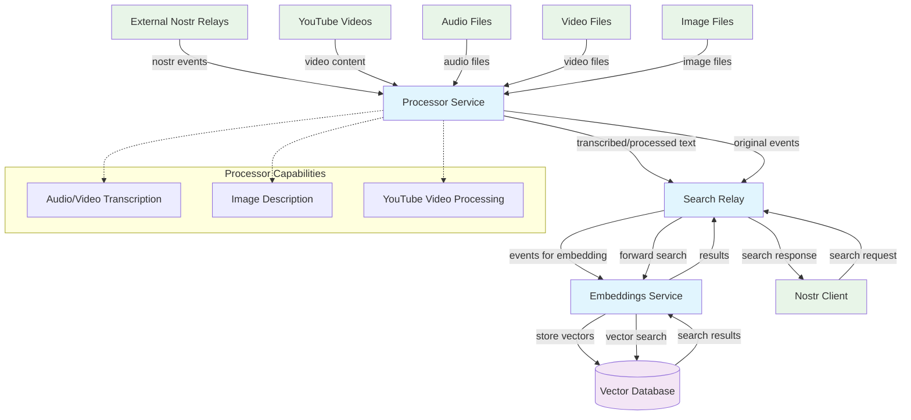

```mermaid
graph TB
    %% External Sources
    YT[YouTube Videos]
    AUDIO[Audio Files]
    VIDEO[Video Files]
    IMAGES[Image Files]
    RELAYS[External Nostr Relays]

    %% Core Services
    PROCESSOR[Processor Service]
    RELAY[Search Relay]
    EMBEDDINGS[Embeddings Service]

    %% Storage
    DB[(Vector Database)]

    %% Clients
    CLIENT[Nostr Client]

    %% Data Flow
    RELAYS -->|nostr events| PROCESSOR
    YT -->|video content| PROCESSOR
    AUDIO -->|audio files| PROCESSOR
    VIDEO -->|video files| PROCESSOR
    IMAGES -->|image files| PROCESSOR

    PROCESSOR -->|transcribed/processed text| RELAY
    PROCESSOR -->|original events| RELAY

    RELAY -->|events for embedding| EMBEDDINGS
    EMBEDDINGS -->|store vectors| DB

    CLIENT -->|search request| RELAY
    RELAY -->|forward search| EMBEDDINGS
    EMBEDDINGS -->|vector search| DB
    DB -->|search results| EMBEDDINGS
    EMBEDDINGS -->|results| RELAY
    RELAY -->|search response| CLIENT

    %% Processing Details
    subgraph "Processor Capabilities"
        TRANSCRIBE[Audio/Video Transcription]
        DESCRIBE[Image Description]
        YT_PROCESS[YouTube Video Processing]
    end

    PROCESSOR -.-> TRANSCRIBE
    PROCESSOR -.-> DESCRIBE
    PROCESSOR -.-> YT_PROCESS

    %% Styling
    classDef service fill:#e1f5fe
    classDef storage fill:#f3e5f5
    classDef external fill:#e8f5e8

    class PROCESSOR,RELAY,EMBEDDINGS service
    class DB storage
    class YT,AUDIO,VIDEO,IMAGES,RELAYS,CLIENT external
```